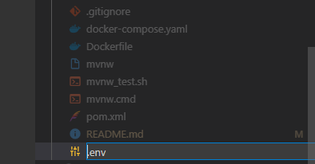
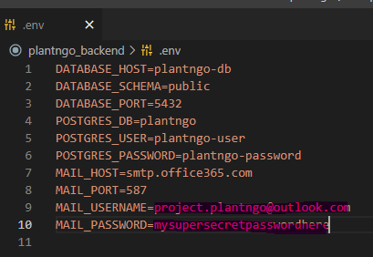

# Plant&Go Backend Server (Spring Boot MVC)
[](https://github.com/plantngo/plantngo_backend/actions/workflows/production-test-suite.yml) [](https://github.com/plantngo/plantngo_backend/actions/workflows/production-ecs-deployment.yml)

The Plant&Go Project consists of two parts:
1. Plant&Go Backend Server (Spring Boot MVC)
2. [Plant&Go Frontend Mobile Application (Flutter)](https://github.com/plantngo/plantngo_frontend)

# Quick Start

## Introduction
Plant&Go is a mobile application that encourages the pursuit of a sustainable diet.

## Usage
This repository only contains the Backend Server built for the [Plant&Go Frontend Mobile Application](https://github.com/plantngo/plantngo_frontend). 

It is recommended that you download the Mobile Application, you can refer to [Plant&Go Frontend Mobile Application's Github Repository](https://github.com/plantngo/plantngo_frontend). It contains the pre-built `.apk` and `.ipa` which uses our Demo Server at [https://github.com/plantngo/plantngo_backend](https://github.com/plantngo/plantngo_backend)

The above way is the fastest way to get started, but if you would still like to host the Backend Server youself, you can refer to the [Setup](#setup) section for detailed guides.

> This project is a demo application, please do not enter any sensitive or important data on this platform.

# Overview
## Solution Architecture

## Database Entity-Relation Diagram


## Swagger API Documentation 
The API Documentation for this Project is on Swagger at [https://plantngo.potatovault.com/swagger-ui/#/](https://plantngo.potatovault.com/swagger-ui/#/) for the API Documentation.

# Setup

## Dependencies
Before getting starting with development/running the application, install the following tools:
- [Docker](https://www.docker.com/products/docker-desktop/)
- [Git](https://git-scm.com/downloads)

## Installation
To start, make a copy of the repository with the `git clone` command or download the repository by clicking, `Code -> Download Zip` on the Github Repository Page.
```bash
git clone https://github.com/CS203-T1-Project/plantngo_backend
```
After cloning the project, you will need to `cd` into the project directory. Open up your terminal and run the following command:
```bash
# change directory into the project
cd plantngo_backed
```

## Configuring Environment Variables

This section covers the fastest way to get setup the environment file to enable the project to work properly.

1. Rename the `sample.env` file in the root of the project directory to `.env`



2. Create an outlook account or use an existing outlook account


3. Edit the renamed `.env` file's MAIL_USERNAME variable to your new email address, and MAIL_PASSWORD variable to the password for your email account.




## Running

Since the project is built with `docker compose`, you will only need `Docker Desktop` to run it locally. 
Do also take note that this project uses the following ports on your localhost:
- `:5432`
- `:8080`

This means if you have an instance of PostgreSQL Server installed or have other web/system apps running on them, you might need to stop the apps running on the respective ports.

### Demo Backend Server

A Demo Backend Server for this Project is hosted at [https://github.com/plantngo/plantngo_backend](https://github.com/plantngo/plantngo_backend). If you wish to just try out the API with tools such as [PostMan](https://www.postman.com/), [Insomnia](https://insomnia.rest/) or [VS Code Rest Client](https://marketplace.visualstudio.com/items?itemName=humao.rest-client), you can do so with the Demo Server.

Refer to the [Swagger Documentation](https://plantngo.potatovault.com/swagger-ui/#/) for the API Documentation on are the expected requests and responses for the API Endpoints.

### Self-Hosted Backend Server

To start the project, use the follow command:
```bash
docker compose up
```

To stop the project, you can press the key combination `Ctrl + C` in the terminal that you previously ran the `docker compose up` command in. After which you will need to run the following command: 

```bash
docker compose down
```

Alternatively, if you wish to delete the local database's records, you can use the command:
```bash
docker compose down --volumes
```


# Contributing
To contribute, you can look at the project wiki's [Contributing](https://github.com/CS203-T1-Project/plantngo_backend/wiki/Contributing) Section.

## Testing

When contributing to the source code, you need to ensure your codes are tested properly with the provided test cases before sending a `Pull-Request` (or merging into any active branches).

If you've created any new classes, it is also expected that you provide sufficient Unit Tests and Integration Tests relating to the classes created.

To run the tests, you can use the following commands:
```java
# runs all test in the project
./mvnw test
```
```java
# runs only one class of tests
./mvnw -Dtest=<ExampleServiceTest> test
```
```
# runs only one method of a specified class of tests
./mvnw -Dtest=<ExampleServiceTest>#<exampleMethod> test
```

